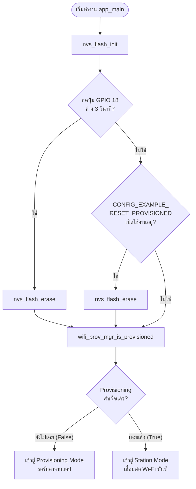
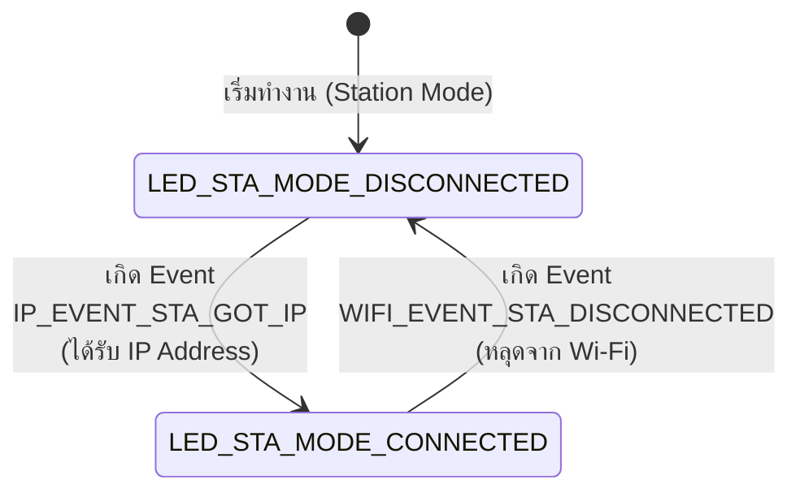

## 5. กิจกรรมถอดรหัสซอร์สโค้ดและเขียนผังงาน (Code Deconstruction & Flowchart Assignment)

ให้นักศึกษาศึกษาโค้ดใน `main/main.c` และ `main/led_indicator.c` แล้วเขียน **ผังงาน (Flowchart / State Diagram)** เพื่ออธิบายการตัดสินใจและการทำงานของระบบ:

### ภารกิจที่ 1 ผังงานการตัดสินใจช่วง Bootstrapping & Reset Decision

ให้นักศึกษาวาด Flowchart แสดงลำดับตรรกะการตรวจสอบเงื่อนไขตั้งแต่เริ่มต้นรันฟังก์ชัน `app_main()` โดยต้องครอบคลุม:

1. การตรวจสอบสถานะปุ่ม **GPIO 18** (ตรวจจับการกดค้าง 3 วินาที)
2. การทำงานของ `nvs_flash_init()` และกรณีที่ต้อง `nvs_flash_erase()`
3. การตรวจสอบ Macro `#ifdef CONFIG_EXAMPLE_RESET_PROVISIONED`
4. การเรียกฟังก์ชัน `wifi_prov_mgr_is_provisioned(&provisioned)`
5. จุดแยกสายการทำงานเข้าสู่โหมด **Provisioning Mode** หรือ **Station Mode**



### ภารกิจที่ 2 ผังสถานะการเปลี่ยนจังหวะไฟ LED 1 (Wi-Fi STA Indicator)

ให้นักศึกษาวาด State Diagram แสดงการเปลี่ยนสถานะของ **LED 1 (GPIO 2)**:

- เงื่อนไขใดทำให้ LED 1 เข้าสู่สถานะ `LED_STA_MODE_DISCONNECTED` (กระพริบ 200ms Mark / 200ms Space)
- เงื่อนไขหรือ Event ใดทำให้เปลี่ยนเป็น `LED_STA_MODE_CONNECTED` (Heartbeat 200ms ทุก 1s)



---

## 6. ตารางบันทึกผลการทดลอง (Experiment Results)

| รูปแบบการ Reset                  | คำสั่ง / พฤติกรรมที่ทำ               | พฤติกรรมของ LED แต่ละดวงหลังเปิดเครื่อง | สถานะใน Serial Monitor                                                                                                                                                                                                                                                                                                                                                                                                                                                                                                                                                                                                     |
| :------------------------------- | :----------------------------------- | :-------------------------------------- | :------------------------------------------------------------------------------------------------------------------------------------------------------------------------------------------------------------------------------------------------------------------------------------------------------------------------------------------------------------------------------------------------------------------------------------------------------------------------------------------------------------------------------------------------------------------------------------------------------------------------- |
| **1. CLI Erase**                 | `idf.py erase-flash`                 | ไฟ LED ดับตลอด                          | W (611) LAB7_1_RESET: --------------------------------------------------<br>W (611) LAB7_1_RESET: [STATUS]: Device is NOT provisioned (NVS is empty)<br>W (621) LAB7_1_RESET: Ready for Provisioning Lab 7-2 (SoftAP) or 7-3 (BLE)!<br>W (631) LAB7_1_RESET: --------------------------------------------------                                                                                                                                                                                                                                                                                                            |
| **2. Menuconfig Flag**           | `CONFIG_EXAMPLE_RESET_PROVISIONED=y` | ไฟ LED ดับตลอด                          | W (611) LAB7_1_RESET: Build-time Reset Flag is ON. Erasing provisioned credentials...<br>W (691) LAB7_1_RESET: --------------------------------------------------<br>W (691) LAB7_1_RESET: [STATUS]: Device is NOT provisioned (NVS is empty)<br>W (691) LAB7_1_RESET: Ready for Provisioning Lab 7-2 (SoftAP) or 7-3 (BLE)!<br>W (701) LAB7_1_RESET: --------------------------------------------------                                                                                                                                                                                                                   |
| **3. Hardware Button (GPIO 18)** | กดปุ่ม GPIO 18 ค้าง 3 วินาที         | ไฟ LED ดับตลอด                          | W (3521) LAB7_1_RESET: =================================================<br>W (3521) LAB7_1_RESET: >>> FACTORY RESET TRIGGERED! ERASING NVS FLASH <<<<br>W (3521) LAB7_1_RESET: =================================================<br>W (3531) LAB7_1_RESET: [FORENSIC]: User requested Flash Erase!<br>W (3681) LAB7_1_RESET: --------------------------------------------------<br>W (3691) LAB7_1_RESET: [STATUS]: Device is NOT provisioned (NVS is empty)<br>W (3691) LAB7_1_RESET: Ready for Provisioning Lab 7-2 (SoftAP) or 7-3 (BLE)!<br>W (3701) LAB7_1_RESET: -------------------------------------------------- |

---

## 7. คำถามท้ายการทดลอง (Post-Lab Questions)

1. เพราะเหตุใดการกดปุ่ม BOOT (GPIO 0) ค้างไว้ในจังหวะรีเซ็ตบอร์ด จึงทำให้โปรแกรมค้างอยู่ที่ ROM Bootloader และไม่ยอมทำงานต่อ?
> เพราะขานี้ถูกใช้เลือกโหมดเริ่มทำงาน หากมีสถานะเป็นไฟต่ำตอนเปิดเครื่อง ชิปจะเข้ารอรับโปรแกรมใหม่แทนการทำงานปกติ

2. เพราะเหตุใดคำสั่ง `idf.py erase-flash` จึงทำให้ข้อมูลเฟิร์มแวร์ Application หายไปด้วย ในขณะที่ `nvs_flash_erase()` ไม่ทำให้เฟิร์มแวร์หาย?
> คำสั่งแรกลบหน่วยความจำทั้งหมดรวมถึงตัวโปรแกรม แต่คำสั่งหลังลบเฉพาะพื้นที่ที่เก็บการตั้งค่าเท่านั้น

3. การออกแบบปุ่ม Factory Reset บนอุปกรณ์ IoT เชิงพาณิชย์ เหตุใดจึงต้องกำหนดให้ผู้ใช้กดปุ่มค้างไว้ 3-5 วินาที แทนที่จะสั่งลบข้อมูลทันทีที่แตะปุ่มเพียงเสี้ยววินาที?
> เพื่อป้องกันผู้ใช้เผลอกดโดนหรือเกิดสัญญาณรบกวน ซึ่งอาจทำให้ข้อมูลถูกลบโดยไม่ตั้งใจ

4. หากอุปกรณ์ IoT ถูกติดตั้งอยู่บนเสาสูงหรือฝังอยู่ในผนัง วิธีการ Reset ทางกายภาพรูปแบบใดเหมาะสมที่สุด?
> การปิดและเปิดสวิตช์ไฟตามจังหวะที่กำหนด เพราะสามารถสั่งล้างข้อมูลได้โดยไม่ต้องสัมผัสตัวอุปกรณ์

---

## Log ผลการทดลอง

**1. CLI Erase (`idf.py erase-flash`)**
```text
W (611) LAB7_1_RESET: --------------------------------------------------
W (611) LAB7_1_RESET: [STATUS]: Device is NOT provisioned (NVS is empty)
W (621) LAB7_1_RESET: Ready for Provisioning Lab 7-2 (SoftAP) or 7-3 (BLE)!
W (631) LAB7_1_RESET: --------------------------------------------------
```

**2. Menuconfig Flag (`CONFIG_EXAMPLE_RESET_PROVISIONED=y`)**
```text
W (611) LAB7_1_RESET: Build-time Reset Flag is ON. Erasing provisioned credentials...
W (691) LAB7_1_RESET: --------------------------------------------------
W (691) LAB7_1_RESET: [STATUS]: Device is NOT provisioned (NVS is empty)
W (691) LAB7_1_RESET: Ready for Provisioning Lab 7-2 (SoftAP) or 7-3 (BLE)!
W (701) LAB7_1_RESET: --------------------------------------------------
```

**3. Hardware Button (GPIO 18)**
```text
I (511) LAB7_1_RESET: Hold GPIO 18 button for 3 seconds to trigger Factory Reset...
I (1521) LAB7_1_RESET: Holding button... 1/3 seconds
I (2521) LAB7_1_RESET: Holding button... 2/3 seconds
I (3521) LAB7_1_RESET: Holding button... 3/3 seconds
W (3521) LAB7_1_RESET: =================================================
W (3521) LAB7_1_RESET: >>> FACTORY RESET TRIGGERED! ERASING NVS FLASH <<<
W (3521) LAB7_1_RESET: =================================================
W (3531) LAB7_1_RESET: [FORENSIC]: User requested Flash Erase!
W (3681) LAB7_1_RESET: --------------------------------------------------
W (3691) LAB7_1_RESET: [STATUS]: Device is NOT provisioned (NVS is empty)
W (3691) LAB7_1_RESET: Ready for Provisioning Lab 7-2 (SoftAP) or 7-3 (BLE)!
W (3701) LAB7_1_RESET: --------------------------------------------------
```
