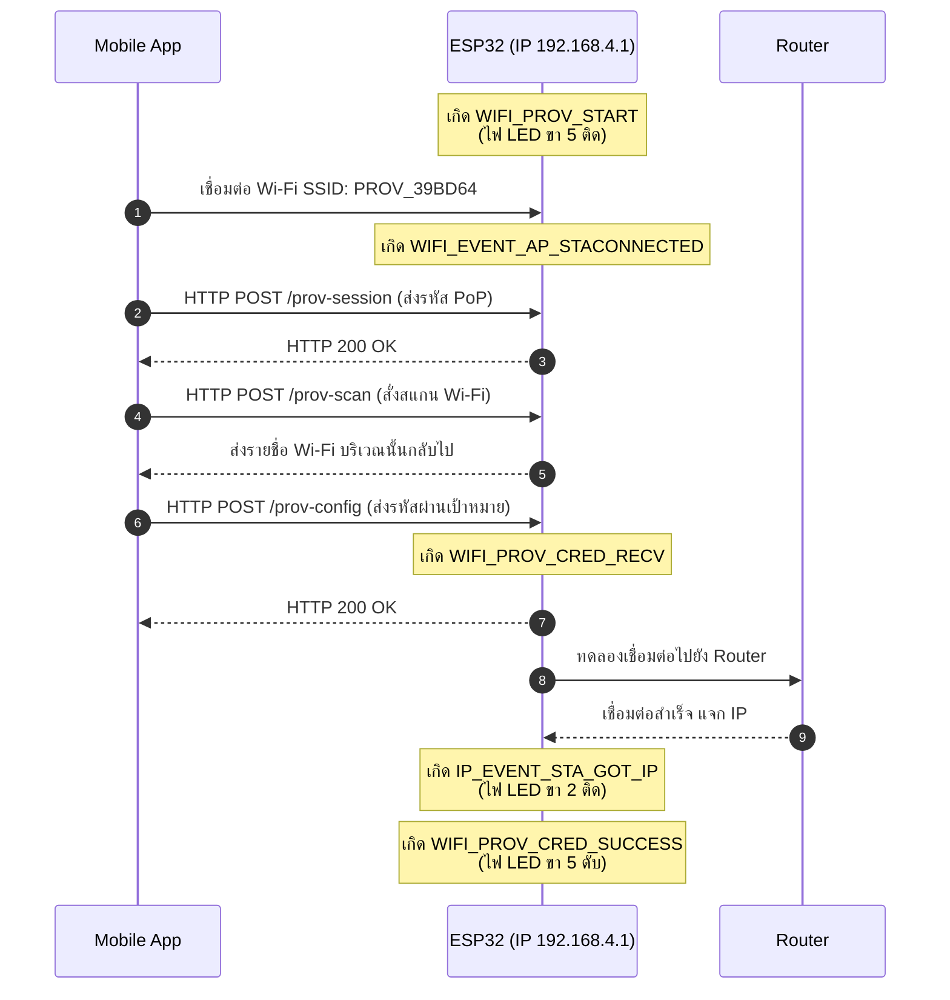

## 5. กิจกรรมถอดรหัสซอร์สโค้ดและเขียนผังงาน (Code Deconstruction & Sequence Flow Assignment)

ให้นักศึกษาแกะรอยการทำงานจาก `main/main.c` ในโหมด SoftAP แล้วเขียน **แผนภาพลำดับเหตุการณ์ (Sequence Diagram)**:

### ภารกิจที่ 1: ผังลำดับการสื่อสารผ่าน HTTP Endpoints (SoftAP Scheme Sequence Flow)
ให้นักศึกษาวาด Sequence Diagram แสดงปฏิสัมพันธ์ระหว่าง 3 ฝ่าย:
1. **Smartphone App (ESP SoftAP Prov)**
2. **ESP32 SoftAP Webserver (Protocomm Layer)**
3. **Wi-Fi Router (AP ปลายทาง)**

**จุดที่ต้องระบุในผัง:**
- จังหวะที่มือถือยิง HTTP POST ไปยัง Endpoint แต่ละตัว (`/prov-session`, `/prov-scan`, `/prov-config`)
- Event ของ ESP-IDF ที่ถูก Trigger ใน `event_handler()` เช่น:
  - `WIFI_EVENT_AP_STACONNECTED`
  - `PROTOCOMM_SECURITY_SESSION_SETUP_OK`
  - `WIFI_PROV_CRED_RECV`
  - `WIFI_PROV_CRED_SUCCESS`
  - `IP_EVENT_STA_GOT_IP`
- สถานะจังหวะการกระพริบของ **LED 3 (GPIO 5)** และ **LED 1 (GPIO 2)** ในแต่ละช่วง

---

## 6. ตารางบันทึกผลการทดลอง (Experiment Results)

| รายการตรวจสอบ | ค่าที่บันทึกได้จากการทดลอง |
| :--- | :--- |
| **1. ชื่อ SoftAP SSID ของ ESP32** | `PROV_39BD64` |
| **2. รหัส PoP (Proof of Possession)** | `abcd1234` |
| **3. ข้อความใน QR Code Payload (JSON)** | `{"ver":"v1","name":"PROV_39BD64","pop":"abcd1234","transport":"softap"}` |
| **4. พฤติกรรมไฟ LED 3 (GPIO 5) ช่วงรอ vs ช่วงส่งข้อมูล** | ตอนรอจะสว่างค้างไว้ พอส่งเสร็จไฟจะดับลง |
| **5. IP Address ที่ ESP32 ได้รับจาก Router** | `192.168.1.150` |
| **6. เวลาที่ใช้ตั้งแต่เริ่มจนจบกระบวนการ (วินาที)** | 20 วินาที |

---

## 7. คำถามท้ายการทดลอง (Post-Lab Questions)
1. ในโหมด SoftAP Scheme สมาร์ตโฟนส่งข้อมูลหา ESP32 ผ่านโปรโตคอลและ IP Address ใด?
> ผ่านโปรโตคอล HTTP ใช้ IP 192.168.4.1

2. หากผู้ใช้ป้อนรหัสผ่าน Wi-Fi ผิดในแอปมือถือ จะเกิด Event ใดขึ้นบน ESP32 (`WIFI_PROV_CRED_FAIL` หรือไม่) และ ESP32 มีพฤติกรรมอย่างไร?
> เกิด WIFI_PROV_CRED_FAIL บอร์ดจะแจ้ง error ใน log แต่ยังปล่อย Wi-Fi ให้เราใส่รหัสใหม่ได้เรื่อยๆ

3. ทำไมผู้ผลิต IoT ส่วนใหญ่จึงมองว่ากระบวนการเชื่อมต่อแบบ SoftAP มีขั้นตอนที่ยุ่งยากสำหรับผู้ใช้ทั่วไปเมื่อเทียบกับ BLE?
> เพราะเวลาต่อ SoftAP มือถือมักจะฟ้องว่าไม่มีเน็ตแล้วชอบสลับกลับไปใช้ 4G เอง ทำให้หลุดบ่อย ถ้าเป็นบลูทูธมือถือจะไม่ต้องสลับเน็ตเลยทำให้ตั้งค่าง่ายกว่า