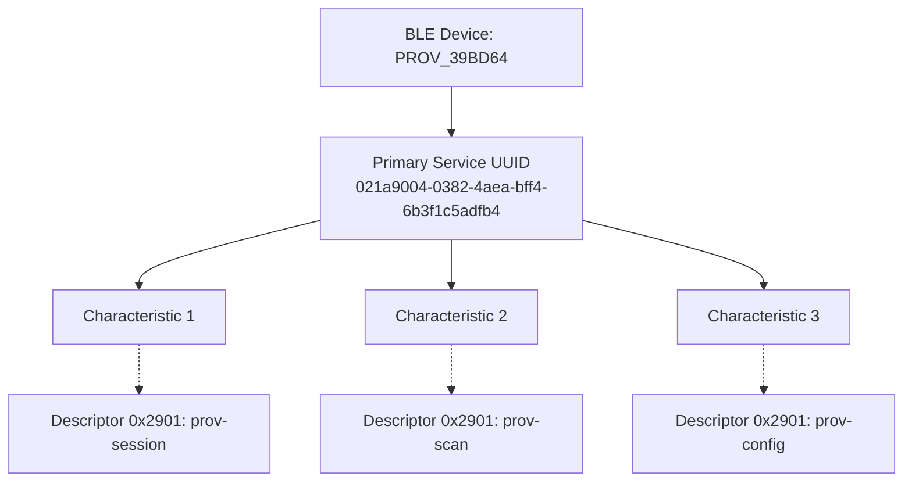
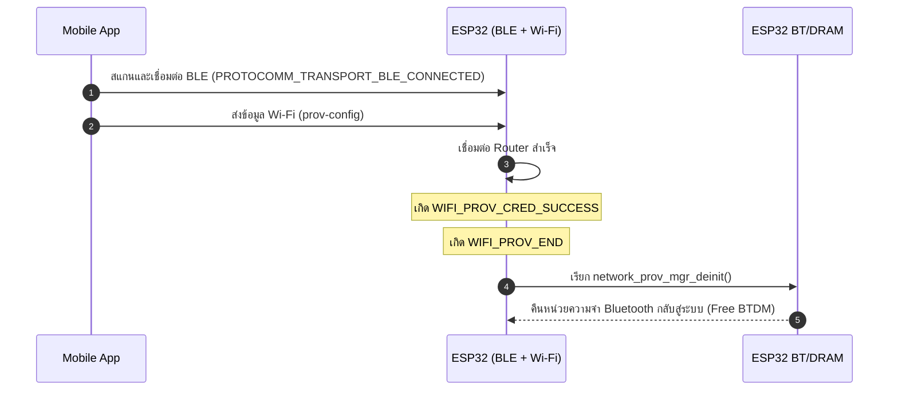

## 5. กิจกรรมถอดรหัสซอร์สโค้ดและเขียนผังงาน (Code Deconstruction & BLE GATT Architecture Assignment)

ให้นักศึกษาแกะรอยการทำงานของโมดูล BLE Provisioning ใน `main/main.c` แล้วเขียน **ผังโครงสร้างและลำดับเหตุการณ์**:

### ภารกิจที่ 1: ผังโครงสร้าง GATT Tree & Endpoint Mapping

ให้นักศึกษาวาดโครงสร้างต้นไม้ (Tree Diagram / Block Diagram) แสดงความสัมพันธ์ระหว่าง:

- **Primary Service (128-bit UUID: `021a9004-...`)**
  - **Characteristic UUIDs** แต่ละตัว
  - **Descriptor 0x2901 (User Description)** ที่ผูกเข้ากับ Protocomm Endpoints (`prov-session`, `prov-config`, `prov-scan`, `proto-ver`, `custom-data`)

### ภารกิจที่ 2: ผังลำดับการคืนหน่วยความจำ Bluetooth (BLE Lifecycle & Memory Reclaim Flow)

ให้นักศึกษาวาด Flowchart / Sequence แสดงว่า:

1. การเชื่อมต่อ BLE ถูกตรวจพบผ่าน Event `PROTOCOMM_TRANSPORT_BLE_CONNECTED` (LED 2 กระพริบเร็ว 100ms)
2. เมื่อเชื่อมต่อ Wi-Fi สำเร็จ (`WIFI_PROV_CRED_SUCCESS`) $\rightarrow$ เกิด Event `WIFI_PROV_END`
3. Provisioning Manager สั่งเรียก `esp_bt_mem_release()` เพื่อปล่อย DRAM คืนสู่ระบบอย่างไร

### ผังโครงสร้าง GATT Tree (ภารกิจที่ 1)


### ผังลำดับการคืนหน่วยความจำ (ภารกิจที่ 2)


---

## 6. ตารางบันทึกผลการทดลอง (Experiment Results)

| รายการตรวจสอบ | ผลการทดลอง / ข้อมูลที่สังเกตได้ |
| :--- | :--- |
| **1. BLE Device Name ที่สแกนเจอ** | `PROV_39BD64` |
| **2. Primary Service UUID (128-bit)** | `021a9004-0382-4aea-bff4-6b3f1c5adfb4` |
| **3. Characteristic Endpoint ที่พบ (0x2901)** | 1. `prov-session`<br/>2. `prov-scan`<br/>3. `prov-config` |
| **4. พฤติกรรมไฟ LED 2 (GPIO 4)** | ตอนรอจะติดสว่างค้างไว้ พอส่งข้อมูลเสร็จไฟจะดับลง |
| **5. พฤติกรรมเมื่อต่อ Wi-Fi สำเร็จ** | มี (แสดงข้อความ "Releasing BT Memory...") |

---

## 7. คำถามท้ายการทดลอง (Post-Lab Questions)

1. เหตุใด BLE Provisioning จึงไม่ส่งผลให้สัญญาณ Wi-Fi บนสมาร์ตโฟนของผู้ใช้หลุดระหว่างทำรายการ?
   > เพราะใช้บลูทูธในการส่งข้อมูลแทน Wi-Fi ทำให้มือถือไม่ต้องตัดเน็ตตัวเองเพื่อไปเชื่อมต่อกับบอร์ดแบบ SoftAP

2. Descriptor `0x2901` มีความสำคัญอย่างไรต่อการที่แอปพลิเคชันมือถือจะทราบว่า Characteristic แต่ละตัวใช้ทำหน้าที่อะไร?
   > เป็นเหมือนป้ายชื่อ (User Description) ที่บอกแอปว่า Characteristic แต่ละท่อคืออะไร (เช่น อันนี้คือ prov-session นะ, อันนี้คือ prov-config นะ) แอปจะได้ส่งข้อมูลถูกท่อ

3. การที่ ESP-IDF มีฟังก์ชัน `esp_bt_mem_release()` มีประโยชน์อย่างไรต่อการทำงานของแอปพลิเคชัน IoT หลังเชื่อมต่อ Wi-Fi สำเร็จ?
   > ช่วยคืนหน่วยความจำแรมที่ระบบบลูทูธจองไว้กลับมาให้โปรแกรมเอาไปใช้ต่อได้ เพราะพอต่อเน็ตเสร็จแล้วบลูทูธก็ไม่ได้ใช้แล้ว บอร์ดจะได้มีแรมเหลือไปรันอย่างอื่นได้เยอะขึ้น

---

## Log ผลการทดลอง
```text
I (45640) LAB7_3_BLE: [BLE]: Smartphone Connected to GATT Server!
I (46320) protocomm_nimble: mtu update event; conn_handle=0 cid=4 mtu=256
I (159210) LAB7_3_BLE: =================================================
I (159220) LAB7_3_BLE: [BLE CREDENTIALS RECEIVED]:
I (159220) LAB7_3_BLE:   -> SSID     : FBT4402_***
I (159220) LAB7_3_BLE:   -> Password : **********
I (159220) LAB7_3_BLE: =================================================
I (165040) wifi:new:<2,0>, old:<1,0>, ap:<255,255>, sta:<2,0>, prof:1, snd_ch_cfg:0x0
I (165050) wifi:state: init -> auth (0xb0)
I (165700) wifi:state: auth -> assoc (0x0)
I (165710) wifi:state: assoc -> run (0x10)
I (165810) wifi:connected with FBT4402_***, aid = 3, channel 2, BW20, bssid = 34:4a:c3:**:**:**
I (165810) wifi:security: WPA3-SAE HUNT_AND_PECK, phy: bgn, rssi: -35, cipher(pairwise:0x3, group:0x3), pmf:1
I (167190) LAB7_3_BLE: =================================================
I (167190) LAB7_3_BLE: [ONLINE]: Connected to Wi-Fi with IP: 192.168.1.**
I (167190) LAB7_3_BLE: =================================================
I (167200) esp_netif_handlers: sta ip: 192.168.1.**, mask: 255.255.255.0, gw: 192.168.1.*
I (167200) network_prov_mgr: STA Got IP
I (167210) LAB7_3_BLE: [SUCCESS]: BLE Provisioning Successful!
E (173030) protocomm_nimble: Error setting advertisement data; rc = 30
I (173040) network_prov_mgr: Provisioning stopped
W (173040) LAB7_3_BLE: [BLE]: Smartphone Disconnected from GATT Server
I (173040) LAB7_3_BLE: [PROV EVENT]: De-initializing BLE & Releasing BT Memory...
I (173050) network_prov_scheme_ble: BTDM memory released
```
