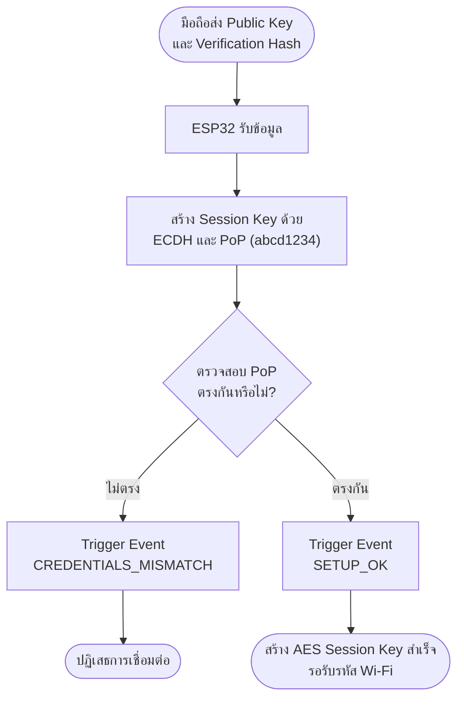
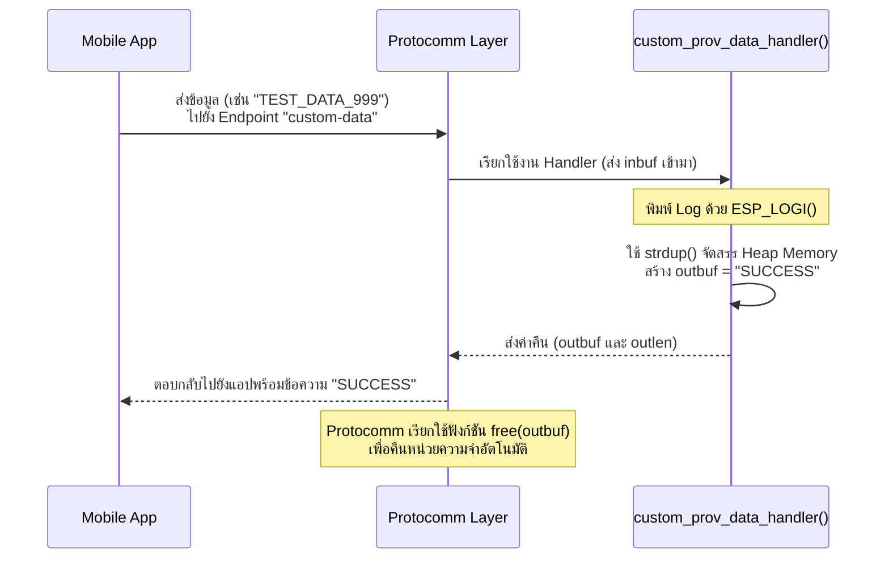

## 6. กิจกรรมถอดรหัสซอร์สโค้ดและเขียนผังงาน (Code Deconstruction & Security Flow Assignment)

ให้นักศึกษาแกะรอยการทำงานด้านความปลอดภัยและ Custom Handler ใน `main/main.c` แล้วเขียน **ผังการไหลของข้อมูล (Data Flow & Cryptographic Handshake Flow)**:

### ภารกิจที่ 1: ผังขั้นตอนการตรวจสอบ PoP (Security Handshake Decision Flow)

ให้นักศึกษาวาด Flowchart แสดงการแลกเปลี่ยนคีย์และตรวจสอบสิทธิ์:

1. การสร้าง Session Parameters ด้วยค่า PoP (`abcd1234`)
2. เมื่อ Client ส่ง Public Key + Verification Hash มาให้ ESP32
3. จุดแยกทางเลือก (Branching):
   - หาก PoP ไม่ตรง $\rightarrow$ Trigger Event `PROTOCOMM_SECURITY_SESSION_CREDENTIALS_MISMATCH` และปฏิเสธการเชื่อมต่อ
   - หาก PoP ถูกต้อง $\rightarrow$ Trigger Event `PROTOCOMM_SECURITY_SESSION_SETUP_OK` และสร้าง AES Session Key สำเร็จ



### ภารกิจที่ 2: ผังการรับส่งข้อมูลผ่าน Custom Endpoint (Custom Data Handler Flow)

ให้นักศึกษาวาด Sequence / Data Flow ของฟังก์ชัน `custom_prov_data_handler()`:



---

## 7. ตารางบันทึกผลการทดลอง (Experiment Results)

| สถานการณ์ทดสอบ          | ค่า PoP ที่ป้อน | ผลลัพธ์บนแอปมือถือ | ข้อความ Log ใน Serial Monitor |
| :---------------------- | :-------------- | :----------------- | :---------------------------- |
| **1. ป้อน PoP ผิดพลาด** | `wrong1234`     | แอปแจ้งเตือนว่า Incorrect PIN / รหัสผิด | `[SECURITY ALERT]: INVALID PoP / Unauthorized Access!` |
| **2. ป้อน PoP ถูกต้อง** | `abcd1234`      | เชื่อมต่อสำเร็จและให้ใส่รหัส Wi-Fi | `[SECURITY SUCCESS]: Valid PoP! Secured Session OK!` |
| **3. ส่ง Custom Data**  | `TEST_DATA_999` | *(ไม่มีให้กรอกในแอปเวอร์ชัน 2.4.5)* | *(ไม่มีให้กรอกในแอปเวอร์ชัน 2.4.5)* |

---

## 8. คำถามท้ายการทดลอง (Post-Lab Questions)

1. การใช้ **Proof-of-Possession (PoP)** ช่วยป้องกันการโจมตีประเภทใดได้บ้าง?
> ช่วยป้องกันการโจมตีแบบคนกลาง (Man-in-the-Middle) และการแอบเชื่อมต่อจากผู้ที่ไม่ได้รับอนุญาต (Unauthorized Access) เพราะมีแค่คนที่มีรหัส PoP (ที่ติดอยู่บนตัวเครื่อง) เท่านั้นที่จะสร้าง Session Key ได้

2. หากไม่มีการใช้ PoP (เช่น ใน Security 0) ผู้โจมตีที่อยู่ในรัศมีสัญญาณบลูทูธสามารถทำสิ่งใดกับอุปกรณ์ได้บ้าง?
> ผู้โจมตีสามารถดักฟังข้อมูล Wi-Fi (SSID/Password) ที่เราส่งให้บอร์ดได้ทั้งหมด (Eavesdropping) หรือสามารถแอบส่ง Wi-Fi ของตัวเองให้บอร์ดไปเชื่อมต่อเพื่อยึดอุปกรณ์ได้ (Device Hijacking)

3. ในการประยุกต์ใช้งานเชิงพาณิชย์จริง เราสามารถนำ **Custom Data Endpoint** ไปใช้ส่งข้อมูลประเภทใดได้อีกบ้าง (ยกตัวอย่าง 2 กรณี)?
> 1. ส่ง User ID / User Token เพื่อผูกอุปกรณ์เข้ากับบัญชีของผู้ใช้บน Cloud ทันที
> 2. ส่งชื่ออุปกรณ์ (Device Name) หรือสถานที่ติดตั้ง (เช่น "แอร์ห้องนอน") เข้าไปบันทึกไว้ในบอร์ด

4. ในฟังก์ชัน `custom_prov_data_handler()` เหตุใดหน่วยความจำที่จัดสรรให้ `*outbuf` จึงถูก Free โดย Protocomm Layer อัตโนมัติหลังจากส่งข้อมูลเสร็จ?
> เพราะตัวแปร Local Array ปกติจะถูกทำลายทิ้งทันทีเมื่อจบฟังก์ชัน ทำให้ Protocomm เอาข้อมูลไปส่งต่อไม่ได้ จึงต้องสร้างด้วย `strdup` (Heap) แล้วให้ Protocomm รับหน้าที่เอาไปส่ง และสั่ง `free()` ทิ้งเองเมื่อส่งเสร็จ เพื่อป้องกัน Memory Leak

---

## Log ผลการทดลอง

**กรณีที่ 1 ป้อน PoP ผิดพลาด (ใส่ `wrong1234`)**
```text
E (18811) security1: Key mismatch. Close connection
E (18821) protocomm_nimble: Invalid content received, killing connection
E (18831) LAB7_4_CUSTOM: --------------------------------------------------
E (18831) LAB7_4_CUSTOM: [SECURITY ALERT]: INVALID PoP / Unauthorized Access!
E (18841) LAB7_4_CUSTOM: --------------------------------------------------
```

**กรณีที่ 2 ป้อน PoP ถูกต้อง (ใส่ `abcd1234`) และเชื่อมต่อเครือข่ายสำเร็จ**
```text
I (35591) LAB7_4_CUSTOM: --------------------------------------------------
I (35601) LAB7_4_CUSTOM: [SECURITY SUCCESS]: Valid PoP! Secured Session OK!
I (35601) LAB7_4_CUSTOM: --------------------------------------------------
E (54841) network_prov_mgr: STA Disconnected
E (54851) network_prov_mgr: STA Auth Error
I (71381) wifi:connected with FBT4402_***, aid = 3, channel 2, BW20, bssid = 34:4a:c3:**:**:**
I (72761) LAB7_4_CUSTOM: [ONLINE]: IP Address: 192.168.1.***
I (72761) esp_netif_handlers: sta ip: 192.168.1.***, mask: 255.255.255.0, gw: 192.168.1.1
I (72761) network_prov_mgr: STA Got IP
I (72771) LAB7_4_CUSTOM: [SUCCESS]: Provisioning Completed!
I (78621) network_prov_mgr: Provisioning stopped
I (78621) network_prov_scheme_ble: BTDM memory released
```
