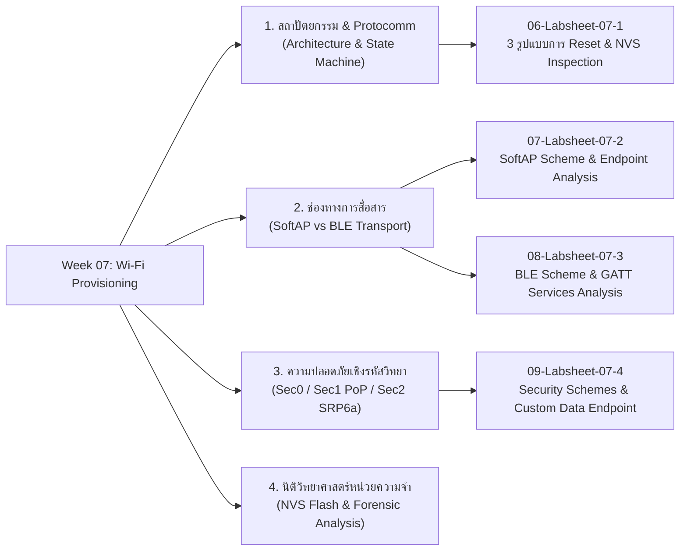

# Week 07: Wi-Fi Provisioning Architecture, Security Schemes & Memory Forensics

## 1. บทนำ (Introduction)
ในสัปดาห์ที่ 7 นี้ เราจะก้าวเข้าสู่กระบวนการที่สำคัญที่สุดกระบวนการหนึ่งของอุปกรณ์ Commercial IoT นั่นคือ **"Wi-Fi Provisioning" (กระบวนการส่งมอบสิทธิ์และการตั้งค่าเครือข่ายไร้สายให้อุปกรณ์ใหม่)** 

ในการพัฒนาอุปกรณ์ IoT สู่เชิงพาณิชย์ อุปกรณ์จะไม่มีหน้าจอหรือคีย์บอร์ดให้ผู้ใช้พิมพ์รหัสผ่าน Wi-Fi เราจึงจำเป็นต้องใช้กลไกการส่งผ่านข้อมูลการเชื่อมต่อ (SSID, Password, Security Keys) จากสมาร์ตโฟนไปยัง ESP32 ผ่านช่องทางสื่อสารชั่วคราว เช่น **SoftAP** หรือ **Bluetooth Low Energy (BLE)** ภายใต้กรอบการรักษาความปลอดภัยขั้นสูง (Cryptographic Security Schemes)

นอกจากนี้ เราจะทำการทดลองเชิง **Forensic Analysis & Memory Inspection** เพื่อสืบสวนและตรวจสอบการจัดเก็บข้อมูล Credentials ใน **NVS (Non-Volatile Storage Flash)** รวมถึงกลไกการล้างค่าคอนฟิก (Factory Reset) ทั้ง 3 รูปแบบ เพื่อทำความเข้าใจความปลอดภัยและความเสี่ยงของอุปกรณ์ IoT ในระดับ Hardware และ Firmware

---

## 2. แผนผังเนื้อหาการเรียนรู้ประจำสัปดาห์ (Lesson Roadmap)

---

## 3. รายการเอกสารบทเรียน (Lesson Materials)

1. **[01-WiFi-Provisioning-Architecture-and-Protocomm.md](01-WiFi-Provisioning-Architecture-and-Protocomm.md)** - สถาปัตยกรรม Provisioning Manager, Protocomm Layer, Data Serialization (Protobuf) และ State Machine Lifecycle
2. **[02-Transport-Comparison-SoftAP-vs-BLE.md](02-Transport-Comparison-SoftAP-vs-BLE.md)** - เปรียบเทียบ SoftAP (HTTP Server Endpoints) vs BLE (GATT Services, UUIDs, Characteristics)
3. **[03-Provisioning-Security-and-Cryptography.md](03-Provisioning-Security-and-Cryptography.md)** - วิเคราะห์ระดับความปลอดภัย Sec0 (Plaintext), Sec1 (X25519 + AES-CTR + Proof-of-Possession), Sec2 (SRP6a + AES-GCM + Salt/Verifier)
4. **[04-Flash-Memory-and-NVS-Forensics.md](04-Flash-Memory-and-NVS-Forensics.md)** - โครงสร้าง Partition Table, NVS Flash (Offset 0x9000), Key-Value Storage Forensics และการกู้คืน/ตรวจสอบข้อมูล
5. **[05-Glossary.md](05-Glossary.md)** - อภิธานศัพท์และคำย่อทางเทคนิคประจำสัปดาห์ที่ 7

---

## 4. รายการใบงานปฏิบัติการประจำสัปดาห์ (Labsheets)

1. **[06-Labsheet-07-1-Reset-Mechanisms-and-NVS-Forensics.md](06-Labsheet-07-1-Reset-Mechanisms-and-NVS-Forensics.md)** - **ใบงานที่ 7.1** ศึกษากลไกการ Reset Provisioning State ทั้ง 3 รูปแบบ (CLI Flash Erase, Menuconfig Build Flag, และ Hardware Pushbutton GPIO 18 Factory Reset)
2. **[07-Labsheet-07-2-SoftAP-Provisioning-and-HTTP-Sniffing.md](07-Labsheet-07-2-SoftAP-Provisioning-and-HTTP-Sniffing.md)** - **ใบงานที่ 7.2** การตั้งค่า Wi-Fi ผ่าน SoftAP Scheme, การสแกน QR Code และการวิเคราะห์ Protocomm Endpoints
3. **[08-Labsheet-07-3-BLE-Provisioning-and-GATT-Forensics.md](08-Labsheet-07-3-BLE-Provisioning-and-GATT-Forensics.md)** - **ใบงานที่ 7.3** การตั้งค่า Wi-Fi ผ่าน BLE Scheme, การสแกนดู GATT Services/UUIDs ด้วยแอป nRF Connect และแอป ESP BLE Provisioning
4. **[09-Labsheet-07-4-Security-Schemes-and-Custom-Data.md](09-Labsheet-07-4-Security-Schemes-and-Custom-Data.md)** - **ใบงานที่ 7.4** การเปรียบเทียบ Security Schemes (Sec0 vs Sec1 PoP), การทดสอบ MITM/Invalid PoP และการรับส่ง Custom Data Payload ผ่าน Callback

---

## 5. สิ่งที่ต้องเตรียมก่อนเริ่มการทดลอง (Prerequisites)

* **ฮาร์ดแวร์:**
  * บอร์ด ESP32 (เช่น ESP32-WROOM-32 / NodeMCU-32S) พร้อมสาย USB
  * หลอดไฟ LED 3 สี พร้อมตัวต้านทาน 220Ω - 330Ω จำนวน 3 ชุด
  * สวิตช์ปุ่มกด (Tactile Pushbutton) จำนวน 1 ตัว พร้อมสายต่อ Breadboard
  * สมาร์ตโฟนระบบปฏิบัติการ Android หรือ iOS ที่รองรับ Wi-Fi และ Bluetooth 4.2+ (BLE)

### ตารางผังการต่ออุปกรณ์ (Hardware Pinout & LED Status Patterns)

| อุปกรณ์ / ขา GPIO | ฟังก์ชันการทำงาน | รูปแบบจังหวะการกระพริบ (Blink Pattern) | ความหมายของสถานะ |
| :--- | :--- | :--- | :--- |
| **LED 1 (GPIO 2)** | Wi-Fi Station Status | 💓 **Heartbeat:** ติด 200ms / ดับ 800ms (ทุก 1 วินาที) | Provisioned แล้ว & เชื่อมต่อ Wi-Fi สำเร็จ (Online) |
| | | ⚠️ **Blink:** ติด 200ms / ดับ 200ms | Provisioned แล้ว แต่ต่อ Wi-Fi ไม่ติด (Disconnecting) |
| **LED 2 (GPIO 4)** | BLE Provisioning | ⏳ **Slow Blink:** ติด 500ms / ดับ 500ms | กำลังกระจายสัญญาณ BLE รอการเชื่อมต่อ (Advertising) |
| | | ⚡ **Fast Blink:** ติด 100ms / ดับ 100ms | มี Client ต่อ BLE เข้ามา & กำลังรับส่ง Credentials |
| | | 🌑 **ดับสนิท (OFF)** | ไม่อยู่ในโหมด BLE Provisioning |
| **LED 3 (GPIO 5)** | SoftAP Provisioning | ⏳ **Slow Blink:** ติด 500ms / ดับ 500ms | กำลังปล่อย Wi-Fi SoftAP รอการเชื่อมต่อ (Listening) |
| | | ⚡ **Fast Blink:** ติด 100ms / ดับ 100ms | มี Client ต่อ SoftAP & กำลังรับส่งข้อมูลผ่าน HTTP |
| | | 🌑 **ดับสนิท (OFF)** | ไม่อยู่ในโหมด SoftAP Provisioning |
| **Button (GPIO 18)** | Factory Reset Button | กดค้างไว้ 3 วินาที (Active Low ต่อลง GND) | สั่งล้าง NVS Flash และกลับสู่โหมด Provisioning |

* **ซอฟต์แวร์บนคอมพิวเตอร์**
  * ESP-IDF Toolchain (v5.x หรือใหม่กว่า)
  * Serial Monitor Tool (ESP-IDF Monitor)
* **แอปพลิเคชันบนสมาร์ตโฟน**
  * **Playstore**
	  * **[ESP BLE Provisioning](https://play.google.com/store/apps/details?id=com.espressif.provble&pli=1)** (โดย Espressif) - สำหรับทำ Provisioning ผ่าน BLE   
	  * **[ESP SoftAP Provisioning](https://play.google.com/store/apps/details?id=com.espressif.provsoftap)** (โดย Espressif) - สำหรับทำ Provisioning ผ่าน SoftAP
     
	**Github repo** [esp-idf-provisioning-android](https://github.com/espressif/esp-idf-provisioning-android  ) 

* **Appstore**
	- **[ESP BLE Provisioning](https://apps.apple.com/in/app/esp-ble-provisioning/id1473590141)**  (โดย Espressif) - สำหรับทำ Provisioning ผ่าน BLE   
	- **[ESP SoftAP Provisioning](https://apps.apple.com/in/app/esp-softap-provisioning/id1474040630)** (โดย Espressif) - สำหรับทำ Provisioning ผ่าน SoftAP
	
	**Github repo**  [esp-idf-provisioning-ios](https://github.com/espressif/esp-idf-provisioning-ios)

 * **nRF Connect for Mobile** (โดย Nordic Semiconductor) - สำหรับสแกนและตรวจสอบ BLE GATT Services & Characteristics

อ้างอิง
 - **[ESP-IDF Unified Provisioning](https://docs.espressif.com/projects/esp-idf/en/stable/esp32/api-reference/provisioning/provisioning.html#unified-provisioning "Permalink to this heading")**
>	The unified provisioning support in the ESP-IDF provides an extensible mechanism to the developers to configure the device with the Wi-Fi credentials and/or other custom configuration using various transports and different security schemes. Depending on the use case, it provides a complete and ready solution for Wi-Fi network provisioning along with example iOS and Android applications. The developers can choose to extend the device-side and phone-app side implementations to accommodate their requirements for sending additional configuration data. The following are the important features of this implementation

---
ปรับปรุงล่าสุด: สิงหาคม 2569

